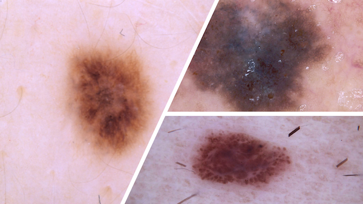

Code Lab 1: Skin Cancer MNIST
==============================
These are the materials for the first code lab in Curae.ai's Deep Learning in Healthcare Workshop.

In this lab, we will get comfortable with our environments and explore a basic computer vision model on a simplified medical dataset: HAM10000.

Specifically, we will walk through how to launch these code labs on your platform of choice.  Then we will learn how to load data, create a convolutional neural network model, and train our model using Tensorflow's Eager Execution API in anticipation of Tensorflow 2.0's default settings. 

# References
_Dataset_
1. Noel Codella, Veronica Rotemberg, Philipp Tschandl, M. Emre Celebi, Stephen Dusza, David Gutman, Brian Helba, Aadi Kalloo, Konstantinos Liopyris, Michael Marchetti, Harald Kittler, Allan Halpern: “Skin Lesion Analysis Toward Melanoma Detection 2018: A Challenge Hosted by the International Skin Imaging Collaboration (ISIC)”, 2018; https://arxiv.org/abs/1902.03368
2. Tschandl, P., Rosendahl, C. & Kittler, H. The HAM10000 dataset, a large collection of multi-source dermatoscopic images of common pigmented skin lesions. Sci. Data 5, 180161 doi:10.1038/sdata.2018.161 (2018).
